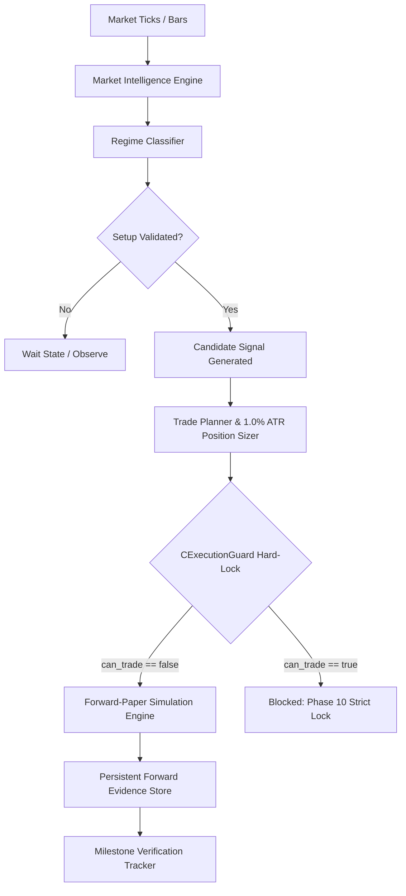

# NeuroPip

**Intelligent Automated Trading Technology for MetaTrader 5**  
**Developed by NextGen Technologies**

---

> ### ⚠️ Regulatory & Forward-Validation Notice
> **Current Development Status:** Phase 10 — Forward-Paper Validation & Evidence Accumulation  
> **Operational Execution Mode:** `MONITOR_ONLY` (`can_trade = false`)  
> **Real-Money Broker Execution:** **STRICTLY DISABLED / HARD-LOCKED**  
>
> NeuroPip is an active quantitative research and automated trading system currently undergoing forward-paper validation on an Exness DEMO environment. 
> 
> - **Zero Claim of Profitability:** This technology does not claim profitability or commercial production readiness.
> - **Sample Accumulation Stage:** The system is accumulating genuine forward-paper evidence toward an initial statistical milestone ($N = 15$ trades). As of the current baseline, genuine forward closed trades stand at $N = 0$.
> - **Statistical Status:** The system is officially classified as `INSUFFICIENT_SAMPLE`. Real broker order dispatch (`OrderSend`) is mathematically and programmatically blocked by `CExecutionGuard`.

---

## 1. Product Overview

**NeuroPip** is an enterprise-grade automated trading technology built natively for MetaTrader 5 (MQL5) with companion Python runtime monitoring infrastructure. Developed by **NextGen Technologies**, NeuroPip decouples market intelligence, regime classification, trade planning, position sizing, risk budgeting, and broker execution into independently testable, audited layers.

### Core Architectural Principles
1. **Local Execution Autonomy:** All market analysis, risk calculations, order sizing, and candidate checks occur strictly within the local MT5 process. No external cloud service can arbitrarily trigger broker execution.
2. **Immutable Strategy Specification:** Core strategy logic, indicator parameters, and risk ratios are frozen and cryptographically tracked via an immutable configuration fingerprint.
3. **Execution Guard Hard-Lock:** Multi-layered programmatic safety guards prevent live execution until empirical forward evidence milestones have been formally satisfied and verified.

---

## 2. Frozen Strategy Baseline

During Phase 10 validation, the trading strategy is held in an immutable state to eliminate overfitting and forward lookahead bias:

| Parameter | Frozen Specification |
|---|---|
| **Strategy Name** | Trend Continuation (`NEUROPIP_TREND_CONTINUATION`) |
| **Strategy Fingerprint** | `FP-B741A5209E579706` |
| **Risk Budget per Trade** | `1.0%` of account equity |
| **Stop Loss (SL) Model** | `2.0 × ATR` (M15 Average True Range) |
| **Take Profit (TP) Model** | `2.0 × RR` (Risk-to-Reward ratio) |
| **Minimum Allowable RR** | `1.50` |
| **Market Universe** | `EURUSDm`, `USDJPYm`, `XAUUSDm`, `BTCUSDm`, `ETHUSDm` |
| **Primary Chart Timeframe** | `M1` (multi-timeframe context across M5, M15, H1, H4, D1) |
| **Safety State** | `can_trade = false` \| `MONITOR_ONLY = true` |

---

## 3. Repository Structure

```text
neuropip/
├── .github/
│   └── workflows/              # Automated build, linting, and CI pipelines
├── config/                     # Sanitized configuration and startup templates
├── docs/                       # Architecture, risk specifications, and milestone reports
│   ├── architecture/           # Technical design and data flow specifications
│   ├── evaluation/             # Statistical evaluation methodology (Phases 8–10)
│   └── security/               # Execution guard & capabilities boundaries
├── monitoring/                 # Runtime supervisor & health check watchdog
├── mt5/
│   └── Experts/
│       └── NeuroPip/           # Modular MQL5 Expert Advisor source code
├── telemetry/                  # Read-only audit schemas and metrics contracts
└── tests/                      # Automated unit, integration, and regression suites
```

---

## 4. Safety & Execution Boundary Model

NeuroPip implements a non-custodial execution boundary enforced by `CExecutionGuard`:



- **Zero Broker Impact:** Candidate setups are passed exclusively to the paper execution pipeline. No live or demo broker orders are submitted.
- **Audit Logging:** Every signal candidate, simulated fill, and state transition is committed to an append-only audit trail.

---

## 5. Development & Validation Roadmap

| Phase | Milestone | Operational Status |
|---|---|---|
| **Phases 1–7** | Foundation, Regimes, Risk, Paper Engine | ✅ Complete (100% test coverage) |
| **Phase 8** | Statistical Evaluation Framework | ✅ Complete |
| **Phase 9** | Forward-Paper Validation Infrastructure | ✅ Complete |
| **Phase 10** | **Forward Evidence Accumulation ($N = 0 \to 15$)** | 🟢 **ACTIVE (Current Stage)** |
| **Phase 11** | Empirical Validation Audit ($N \ge 15$) | ⏳ Planned |
| **Phase 12** | Commercial Distribution & Cloud Telemetry | ⏳ Future Stage |

---

## 6. Security & Credential Governance

- **No Secrets in Source:** This repository contains zero credentials, broker passwords, API keys, live account numbers, or machine-specific absolute paths.
- **Configuration Templates:** All configuration files in `config/` are sanitised `.example` templates requiring explicit local setup.
- **Automated Scanning:** All pull requests are audited to ensure credentials and compiled binaries remain excluded from version history.

---

## 7. License & Intellectual Property

Copyright © 2026 **NextGen Technologies**. All rights reserved.  
NeuroPip is proprietary software. Unauthorized reproduction, distribution, decompilation, or live commercial usage is strictly prohibited. See [`LICENSE`](./LICENSE) for full legal terms.
