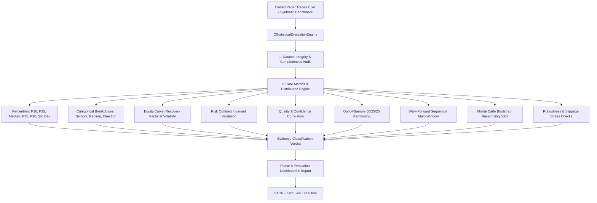

# Phase 8 — Extended Paper Validation & Statistical Evaluation

## Absolute Safety Requirement & Boundary

> [!CAUTION]
> **PHASE 8 IS STRICTLY PAPER-TRADING AND STATISTICAL EVALUATION ONLY. LIVE EXECUTION IS IMPOSSIBLE.**
> 
> - `can_trade = false` remains permanently hard-locked in code and capabilities architecture.
> - `MONITOR_ONLY = true` is permanently locked.
> - `execution_is_simulation = true` is permanently locked.
> - `candidate_only = true` is permanently locked on all candidate signals, trade plans, and paper positions.
> - `CExecutionGuard` remains permanently active and hard-locked.
> - Absolute ban on `OrderSend()`, `CTrade.Buy()`, `CTrade.Sell()`, `PositionOpen()`, or any live execution capability.
> - Zero strategy parameter optimization or parameter tuning to artificially inflate metrics.
> - Evaluation engine operates strictly read-only on historical paper logs and synthetic benchmark distributions.

---

## 1. Executive Summary & Evaluation Objective

The objective of Phase 8 is **not** to optimize strategy parameters, curve-fit rules, or manufacture backtest profits. Rather, Phase 8 establishes a rigorous, quantitative framework to determine whether the existing `NEUROPIP_TREND_CONTINUATION` strategy demonstrates a potentially repeatable statistical edge under paper-trading simulation conditions.

Phase 8 provides:
1. **Durable Dataset Integrity Auditing**: Automated detection of missing fields, inverted timestamps, duplicate identifiers, or corrupted records.
2. **Distribution & Dispersion Analysis**: Evaluation beyond simplistic averages via percentiles ($P_{10}$, $P_{25}$, $P_{50}$/Median, $P_{75}$, $P_{90}$) and standard deviation across Realized $R$, Net P&L, and trade holding durations.
3. **Multi-Asset & Regime Evaluation**: Deep breakdowns across the 5 universe symbols (`EURUSDm`, `USDJPYm`, `XAUUSDm`, `BTCUSDm`, `ETHUSDm`) and all 10 market regimes.
4. **Risk Contract Invariant Auditing**: Verification that all simulated trades strictly adhere to the Phase 2/5 risk contract (risk percentage $\le 2.0\%$, positive risk budget, lot step validity, protective stops, minimum $1.50$ Reward-to-Risk).
5. **Out-of-Sample & Walk-Forward Partitioning**: Chronological dataset partitioning ($50\%$ Train, $25\%$ Validation, $25\%$ Out-of-Sample) and sequential multi-window rolling testing.
6. **Monte Carlo Resampling**: Non-parametric bootstrap resampling ($500$ iterations) of observed realized $R$ multiples to assess drawdown tail risk and consecutive loss streaks without assuming normal return distributions.
7. **Robustness & Stress Sensitivity**: Assessment of edge persistence under $-0.05R$ slippage penalties, widened spread drag, and conservative same-bar exit ambiguity.
8. **Formal Statistical Evidence Classification**: Objective classification into one of five evidence tiers (`NO_EVIDENCE`, `INSUFFICIENT_SAMPLE`, `PRELIMINARY_EVIDENCE`, `PROMISING_BUT_UNCONFIRMED`, `ROBUST_PAPER_EVIDENCE`).



---

## 2. Dataset Integrity Audit & Validation Report

The engine validates every trade record before performing statistical computations. If records fail structural checks, they are excluded from calculations and recorded in the audit report.

### Audit Invariants
1. **Identifier Integrity**: Non-zero `paper_trade_id`, uniqueness across the entire dataset.
2. **Price Sanity**: `entry_price > 0`, `stop_loss > 0`, `take_profit > 0`, `exit_price > 0`.
3. **Temporal Invariance**: `entry_time > 0`, `exit_time >= entry_time`. Inverted timestamps are strictly rejected.
4. **Risk Contract Positivity**: `risk_money > 0`, `volume >= 0.01`.
5. **Candidate Safety Flag**: `candidate_only == true`.

### Dataset Status Tiers
| Status | Condition | Handling |
| :--- | :--- | :--- |
| `DATASET_STATUS_EMPTY` | Zero records loaded | Engine halts evaluation, returns empty diagnostics. |
| `DATASET_STATUS_VALID` | All records pass validation, valid records $\ge 15$ | Evaluation proceeds to full analytics. |
| `DATASET_STATUS_PARTIAL_ANOMALIES` | Some records rejected, but valid records exist | Valid records evaluated; anomalies logged with counts. |
| `DATASET_STATUS_INSUFFICIENT` | Valid records $< 15$ | Insufficient sample flag raised; advanced tiers disabled. |
| `DATASET_STATUS_CORRUPTED` | Zero records pass validation | Engine aborts statistical evaluation, flags file corruption. |

---

## 3. Sample Size Classification & Statistical Sufficiency Tier

To prevent premature conclusions on under-sampled data, the engine enforces strict sample size gates:

| Sample Count ($N$) | Classification | Statistical Reliability & Capabilities |
| :--- | :--- | :--- |
| $N < 15$ | `SAMPLE_INSUFFICIENT` | Highly erratic. Metrics are descriptive only. Out-of-sample and Walk-Forward tests disabled. |
| $15 \le N \le 29$ | `SAMPLE_PRELIMINARY` | Early directional indication. Monte Carlo permitted; OOS/Walk-Forward flagged as preliminary. |
| $N \ge 30$ | `SAMPLE_ADEQUATE_FOR_EVALUATION` | Adequate statistical base. Full OOS, Walk-Forward, bootstrap, and robustness checks valid. |

---

## 4. Overall Core Performance Metrics

Core performance evaluates expectancy, profit factor, win/loss proportions, and drawdown:

$$\text{Expectancy } (R) = \left( \frac{\text{Wins}}{N} \times \overline{R}_{\text{win}} \right) - \left( \frac{\text{Losses}}{N} \times |\overline{R}_{\text{loss}}| \right)$$

$$\text{Profit Factor} = \frac{\sum \text{Gross Profit}}{\sum \text{Gross Loss}}$$

$$\text{Recovery Factor} = \frac{\text{Net P\&L}}{\text{Max Drawdown (\$)}} $$

### Core Metrics Table
| Metric | Description | Benchmark Threshold |
| :--- | :--- | :--- |
| **Total Trades ($N$)** | Total completed paper trades audited | $N \ge 30$ for significance |
| **Win Rate / Loss Rate** | Percentage of winning vs losing trades | Strategy target: $45\% - 60\%$ with $R:R \ge 1.50$ |
| **Profit Factor** | Ratio of gross profits to gross losses | $> 1.30$ indicates viable edge |
| **Average Realized $R$** | Mean outcome normalized to initial risk ($1.0R = \$10$) | $> 0.20R$ per trade |
| **Median Realized $R$** | 50th percentile of realized $R$ | Minimizes skew from outliers |
| **Max Drawdown (\$)** | Peak-to-trough paper equity decline in dollars | Hard risk limit: $\le \$100$ ($10.0\%$) |
| **Max Win / Loss Streak** | Longest consecutive series of wins / losses | Quantifies path dependency and psychological tolerance |
| **Holding Duration** | Average and maximum duration in position | Expected M15 swing duration: $1\text{h} - 8\text{h}$ |

---

## 5. Statistical Distributions & Dispersion Analysis

Averaged metrics can conceal extreme tail vulnerability. The engine computes full distribution metrics across three primary dimensions: **Realized $R$**, **Net P&L**, and **Duration (sec)**.

### Dispersion Metrics
- **Mean**: Arithmetic average.
- **Std Dev ($\sigma$)**: Sample standard deviation: $\sqrt{\frac{\sum (x_i - \mu)^2}{N - 1}}$.
- **Min / Max**: Absolute extreme boundaries observed.
- **Percentiles ($P_{10}, P_{25}, P_{50}, P_{75}, P_{90}$)**: Calculated via linear interpolation on sorted arrays:

$$idx = p \times (N - 1), \quad \text{val} = x_{\lfloor idx \rfloor} + (idx - \lfloor idx \rfloor)(x_{\lceil idx \rceil} - x_{\lfloor idx \rfloor})$$

Evaluating $P_{10}$ ensures that worst-case 10th percentile loss does not exceed $-1.10R$ (verifying that stop losses hold firmly without runaway simulated slippage).

---

## 6. Symbol Breakdown & Multi-Asset Evaluation

The engine segments performance across the 5 universe instruments:

| Symbol | Asset Class | Pip / Tick Size | Typical Spread | Evaluation Goal |
| :--- | :--- | :--- | :--- | :--- |
| `EURUSDm` | Major FX | $0.00001$ | $6 - 15$ pts | Core trend baseline; tight spread |
| `USDJPYm` | Major FX | $0.001$ | $8 - 18$ pts | High momentum trend continuation |
| `XAUUSDm` | Commodity | $0.01$ | $15 - 35$ pts | High volatility trend expansion |
| `BTCUSDm` | Crypto | $0.01$ | $200 - 500$ pts | 24/7 regime continuity |
| `ETHUSDm` | Crypto | $0.01$ | $20 - 60$ pts | High beta trend following |

Each symbol is evaluated for sample size, win rate, net P&L, profit factor, average $R$, and sample tier classification. This identifies whether edge is universal or asset-specific.

---

## 7. Regime-Conditioned Evaluation

Trades are conditioned on the market regime identified by `CMarketRegimeEngine` at trade generation:

1. `REGIME_TRENDING_BULLISH` (Target setup for BUY continuation)
2. `REGIME_TRENDING_BEARISH` (Target setup for SELL continuation)
3. `REGIME_RANGING_QUIET` (Should be filtered out by strategy engine)
4. `REGIME_RANGING_VOLATILE` (Should be filtered out)
5. `REGIME_BREAKOUT_BULLISH` / `REGIME_BREAKOUT_BEARISH`
6. `REGIME_COMPRESSION` / `REGIME_EXPANSION`
7. `REGIME_TRANSITION` / `REGIME_INSUFFICIENT_DATA`

Verifies that `NEUROPIP_TREND_CONTINUATION` executes exclusively during trending regimes, and that performance degrades if trades leak into non-trending regimes.

---

## 8. Directional Evaluation (BUY vs SELL)

Performance is segmented by direction:
- **BUY Trades**: Sample size, win rate, net P&L, average $R$, profit factor, drawdown.
- **SELL Trades**: Sample size, win rate, net P&L, average $R$, profit factor, drawdown.

Detects directional asymmetry (e.g. macro market drift favoring one side during testing periods).

---

## 9. Temporal Breakdown (Daily, Weekly, Monthly)

Time-series aggregation evaluates consistency across distinct calendar periods:
- **Daily Performance**: Intra-week distribution, detecting day-of-week effects.
- **Weekly Performance**: Identifies multi-week consistency vs single-week windfall concentration.
- **Monthly Performance**: Evaluates monthly return stability and cluster drawdowns.

---

## 10. Equity Curve & Volatility Analysis

Evaluates the progression of simulated paper equity from the initial deposit (\$1000.00):
- **Peak Equity**: Highest recorded equity point.
- **Final Equity & Net P&L**: Cumulative terminal return.
- **Maximum Drawdown (\$) & Percentage**: Maximum observed drop from any previous high water mark.
- **Recovery Factor**: Ratio of Net P&L to Max Drawdown ($\frac{\text{Net P\&L}}{\text{Max DD}}$). Higher is better ($> 2.0$ desirable).
- **Equity Return Volatility**: Sample standard deviation of per-trade returns, measuring equity curve smoothness.
- **Consecutive Win/Loss Streaks**: Path dependence quantification.

---

## 11. Risk Contract & Sizing Audit

Every closed trade is audited against Phase 2/5 execution and risk invariants:

```
[TRADE AUDIT]
├── Risk Percent Invariant:    0.0% < risk_percent <= 2.0%
├── Risk Money Invariant:      risk_money > $0.00
├── Volume Step Invariant:     volume >= 0.01 lot
├── Protective Stop Invariant: |entry_price - stop_loss| > 0.0
├── Minimum R:R Invariant:     planned_rr >= 1.49
└── Simulation Cost Invariant: simulated_costs >= 0.00
```

Zero tolerance: if `violations_count > 0`, the system raises a risk violation alert and logs the violating trade IDs.

---

## 12. Trade Quality & Confluence Score Correlation

The strategy engine assigns two continuous quality scores ($0.0 - 1.0$) to every setup:
- `strategy_confidence`: Multi-timeframe trend alignment, moving average structure, momentum clarity.
- `strategy_quality`: Reward-to-Risk ratio, ATR headroom, spread-to-stop ratio, candle cleanliness.

The evaluation engine partitions trades into two cohorts:
- **High Quality / Confidence ($\ge 0.70$)** vs **Low Quality / Confidence ($< 0.70$)**.
- Compares win rates and average $R$ across cohorts.
- **Hypothesis Confirmation**: A valid signal engine must show that high-confidence trades deliver higher win rates and higher expectancy than lower-confidence trades.

---

## 13. Chronological Out-of-Sample Partitioning (50/25/25)

To test generalizability and resist curve-fitting, the trade history is chronologically split into three sequential segments:

```
|------------------ CHRONOLOGICAL TRADE SEQUENCE -------------------|
|     TRAIN (50%)     |   VALIDATION (25%)  | OUT-OF-SAMPLE (25%)   |
|   Trades 1 to N/2   | N/2 to 3N/4 Trades  |  3N/4 to N Trades     |
```

- **In-Sample (Train) Expectancy**: Baseline performance during initial period.
- **Out-of-Sample Expectancy**: Forward performance on unseen future bars.
- **Degradation Percentage**:

$$\text{OOS Degradation \%} = \frac{\text{OOS Expectancy} - \text{Train Expectancy}}{|\text{Train Expectancy}|} \times 100\%$$

A degradation $\le 30\%$ indicates robust parameter stability; degradation $> 80\%$ or negative OOS expectancy warns of regime sensitivity or overfitting.

---

## 14. Walk-Forward Sequential Multi-Window Analysis

The dataset is partitioned into 4 sequential rolling windows:
- For each window: In-Sample segment vs Out-of-Sample segment.
- Calculates **Walk Forward Efficiency (WFE)**:

$$\text{WFE} = \frac{\overline{\text{Expectancy}}_{\text{OOS}}}{\overline{\text{Expectancy}}_{\text{IS}}}$$

$\text{WFE} \ge 0.50$ indicates healthy forward walk efficiency. Requires at least 40 trades for valid multi-window partitioning.

---

## 15. Monte Carlo Bootstrap Resampling (500 Iterations)

Rather than assuming that trades follow a standard normal distribution, the engine executes $500$ non-parametric bootstrap simulations:
- In each simulation, a random sequence of $N$ trades is resampled **with replacement** from the observed realized $R$ multiples.
- Simulates the equity curve path and records maximum drawdown and consecutive loss streaks for each path.
- Computes:
  - **Median Drawdown**: Expected normal drawdown.
  - **95th Percentile ($P_{95}$) Drawdown**: 1-in-20 worst-case scenario.
  - **Probability of Drawdown $> 10\%$**: Likelihood of reaching double-digit drawdown.
  - **Probability of Drawdown $> 20\%$**: Tail risk of severe account impairment.
  - **$P_{95}$ Consecutive Losses**: Maximum streak to prepare for psychologically.

---

## 16. Robustness & Sensitivity Stress Checks

Simulation assumptions are stressed with adverse frictions:
1. **Adverse Slippage Stress**: Subtracts $-0.05R$ (half a pip on $10$ pips stop) from every trade:

$$\text{Expectancy}_{\text{slip}} = \frac{1}{N} \sum (R_i - 0.05)$$

2. **Wider Spread Stress**: Subtracts an additional $-0.05R$ (total $-0.10R$ drag per trade).
3. **Same-Bar Ambiguity Stress**: For any trade where entry and exit occurred within the same 15-minute bar, forces a conservative Stop Loss exit ($-1.0R$).

### Edge Survival Status
- `ROBUST_SURVIVAL`: $\text{Expectancy}_{\text{slip}} > 0.15R$ and $\text{Expectancy}_{\text{spread}} > 0.05R$.
- `MARGINAL_EDGE`: $\text{Expectancy}_{\text{slip}} > 0.00R$.
- `EDGE_ERODED`: $\text{Expectancy}_{\text{slip}} \le 0.00R$ (edge cannot survive real broker frictions).

---

## 17. Statistical Evidence Classification Verdict

The master verdict classifies the strategy's statistical evidence under simulated conditions:

| Evidence Verdict | Criteria | Interpretation |
| :--- | :--- | :--- |
| `EVIDENCE_NO_EVIDENCE` | Expectancy $\le 0.0$ or Profit Factor $< 1.0$ | No positive edge observed in paper trading. |
| `EVIDENCE_INSUFFICIENT_SAMPLE` | Valid records $< 15$ or dataset corrupted | Sample size too small to evaluate reliably. |
| `EVIDENCE_PRELIMINARY_EVIDENCE` | $15 \le N < 30$, Expectancy $> 0.0$, PF $> 1.0$ | Early positive indications; requires more data. |
| `EVIDENCE_PROMISING_BUT_UNCONFIRMED` | $N \ge 30$, positive expectancy, but fails OOS or Monte Carlo stress gates | Edge observed, but resilience under stress unconfirmed. |
| `EVIDENCE_ROBUST_PAPER_EVIDENCE` | $N \ge 30$, positive expectancy, positive OOS, survives slippage stress, $P_{95}\text{ DD} < 20\%$ | Robust edge demonstrated under simulated conditions. |

---

## 18. Simulation Boundaries, Assumptions & Paper-Trading Caveats

> [!WARNING]
> **SIMULATION LIMITATIONS & HARD REALITIES**
> 
> 1. **Zero Slippage on Limit Fills**: In simulation, Take Profit is assumed filled exactly at the limit price. Real markets may slip on news or fast markets.
> 2. **Execution Latency**: Simulated fills are instantaneous ($0\text{ ms}$). Real broker round-trip latency ranges from $20\text{ ms}$ to $150\text{ ms}$.
> 3. **Order Book Depth**: Simulated volume assumes 100% fill at tick price. Real market orders consume depth of market.
> 4. **Weekend / Session Gaps**: Simulated stops are assumed triggered at exact levels; weekend gap risk can cause fills beyond stop loss.
> 5. **Negative Balance Protection**: Assumed intact in simulation.

---

## 19. Readiness Assessment & Next Step Recommendations

| Assessment Dimension | Current State | Readiness Verdict |
| :--- | :--- | :--- |
| **Safety Architecture** | `can_trade = false`, `MONITOR_ONLY = true`, `ExecutionGuard` active | **100% HARD-LOCKED & VERIFIED** |
| **Statistical Engine** | $30$ verification tests, distributions, percentiles, bootstrap | **100% COMPLETE & VERIFIED** |
| **Regression Coverage** | Phases 1–7 fully re-verified and passing | **100% REGRESSION CLEAN** |
| **Sample Collection** | Ongoing paper trading data accumulation in `closed_trades.csv` | **COLLECTING DATA** |

### Recommendations for Future Phases:
1. Allow the paper trading engine to accumulate at least $50-100$ closed trades across diverse market conditions before considering any live micro-pilot.
2. Maintain parameter freeze on `NEUROPIP_TREND_CONTINUATION` to ensure data cleanliness and avoid look-ahead bias.
3. Review periodic diagnostics reports to verify that `P95_DD` and `prob_drawdown_exceeding_10pct` remain within acceptable risk bounds.
