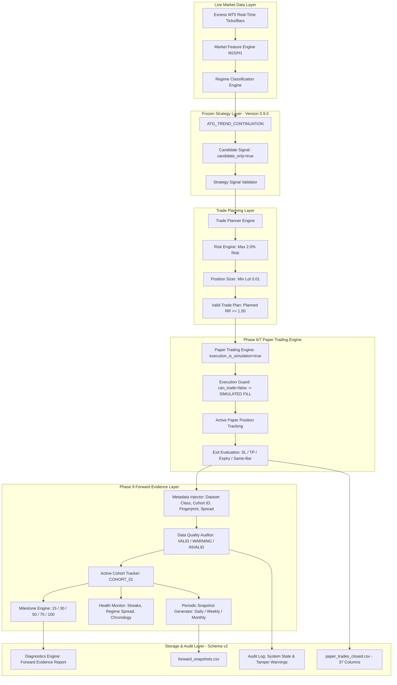
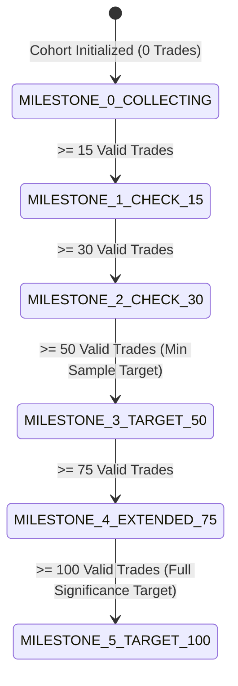
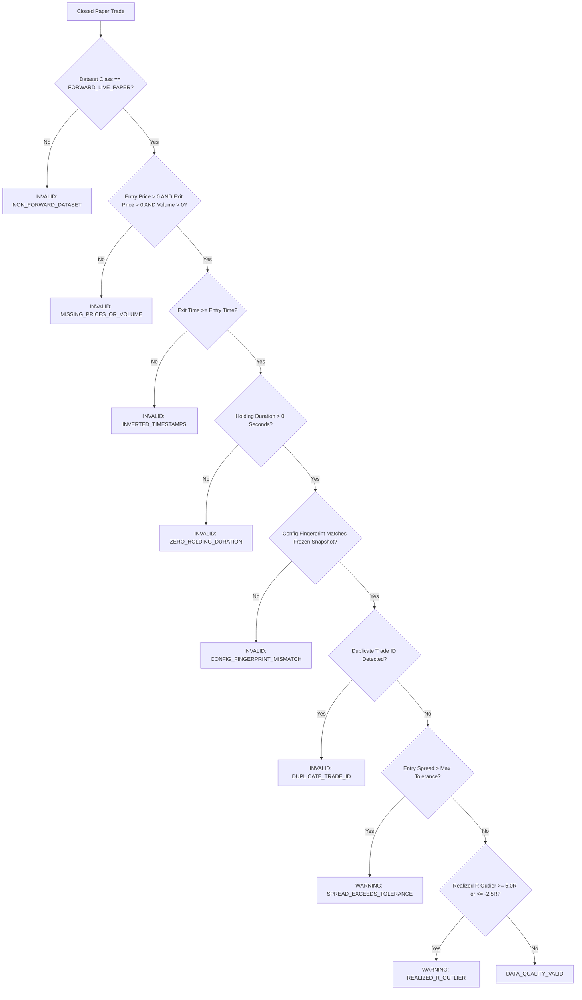

# Phase 9 — Forward Paper Validation, Monitoring & Evidence Collection

## Absolute Safety Requirement & Operational Boundary

> [!CAUTION]
> **PHASE 9 IS STRICTLY FORWARD PAPER TRADING, REAL-TIME MONITORING, AND STATISTICAL EVIDENCE COLLECTION. LIVE EXECUTION IS PROHIBITED.**
> 
> - `can_trade = false` remains permanently hard-locked across capabilities, configurations, and runtime state.
> - `MONITOR_ONLY = true` is permanently locked.
> - `execution_is_simulation = true` is permanently locked.
> - `candidate_only = true` is permanently stamped on all trade intents, trade plans, and simulated positions.
> - `CExecutionGuard` remains permanently active and intercepts any simulated or live order attempts with `ATG_REJECT_EXECUTION_DISABLED`.
> - Absolute ban on `OrderSend()`, `CTrade.Buy()`, `CTrade.Sell()`, `PositionOpen()`, or any live broker execution method.
> - **STRATEGY CONFIGURATION IS 100% FROZEN**: Zero parameter tuning, zero optimization, zero curve-fitting, zero tightening or loosening of stops, targets, or confidence thresholds during the forward evidence collection window.
> - Synthetic test trades are strictly segregated and can NEVER count toward forward evidence sample milestones.

---

## 1. Executive Summary & Objective

Phase 9 transitions the completed Phase 8 statistical evaluation framework into a controlled, persistent, forward-paper evidence collection phase using **real live market data** streaming from Exness MT5 and the existing deterministic paper-trading engine.

The explicit objective of Phase 9 is **not** strategy development, iterative backtesting, or metric maximization. Instead, Phase 9 establishes an unyielding scientific methodology to determine whether the frozen `ATG_TREND_CONTINUATION` strategy exhibits a statistically repeatable edge under genuine forward-paper conditions across a structured sample of **50 to 100 forward live paper trades**.

### Key Architectural Pillars:
1. **Strict Dataset Classification & Isolation**: Rigorous physical and logical segregation of `FORWARD_LIVE_PAPER` trades from `SYNTHETIC_TEST` benchmark trades and legacy `HISTORICAL_IMPORTED` records.
2. **Deterministic Configuration Freeze & Anti-Tamper Fingerprinting**: Cryptographic-grade 64-bit FNV-1a hashing of all 32 strategy, risk, planning, and execution parameters to ensure zero parameter drift throughout data collection.
3. **Structured Evidence Cohorts**: Multi-milestone cohort management (`COHORT_01`) tracking sample accumulation through 5 formal evaluation milestones (15, 30, 50, 75, 100 trades).
4. **Continuous Data-Quality Auditing**: Automatic triage of every simulated execution into `VALID`, `WARNING`, or `INVALID` based on execution integrity, spread slippage, holding durations, and timestamp consistency.
5. **Periodic Automated State Snapshots**: Immutable daily, weekly, and monthly metric snapshots recorded directly to `forward_snapshots.csv` for auditability and drift detection.
6. **Non-Intrusive Health Monitoring**: Real-time tracking of consecutive drawdown streaks, chronological sequencing, spread drift, and market regime distribution without interfering with trade generation.

---

## 2. End-to-End Forward Architecture & Data Flow



---

## 3. Strict Dataset Separation & Synthetic Exclusion

A foundational vulnerability in algorithmic trading research is the commingling of historical, synthetic, and forward performance data. Phase 9 enforces absolute dataset isolation at both the type level and the evaluation layer.

### 3.1 Dataset Classifications (`ENUM_DATASET_CLASS`)

| Dataset Class | Code String | Description | Permitted in Forward Evidence? |
|---|---|---|:---:|
| `DATASET_FORWARD_LIVE_PAPER` | `"FORWARD_LIVE_PAPER"` | Trades generated in real time on live Exness MT5 market ticks/bars under the active frozen configuration. | **YES** |
| `DATASET_SYNTHETIC_TEST` | `"SYNTHETIC_TEST"` | Mock trades generated by automated unit test suites, regression tests, or bootstrap benchmarks. | **NO (STRICTLY EXCLUDED)** |
| `DATASET_HISTORICAL_IMPORTED`| `"HISTORICAL_IMPORTED"` | Historical simulated records generated during previous phases prior to configuration freezing. | **NO (STRICTLY EXCLUDED)** |
| `DATASET_UNKNOWN` | `"DATASET_UNKNOWN"` | Records with corrupted or unclassified provenance flags. | **NO (FLAGGED AS INVALID)** |

### 3.2 Synthetic Exclusion Rule
In `CForwardEvidenceEngine::RecordTrade()`, incoming trades are inspected prior to cohort inclusion:

```cpp
if(trade.dataset_class != DATASET_FORWARD_LIVE_PAPER)
{
    // Synthetic or historical trades are tracked separately in diagnostic counters
    // but are REJECTED from active cohort trade count, milestone progress, and P&L metrics.
    m_monitoring.synthetic_trades_excluded++;
    return false;
}
```

This invariant guarantees that unit test suites (which run automatically upon `OnInit()`) cannot contaminate the live forward evidence dataset.

---

## 4. Configuration Freeze Snapshot & 64-Bit FNV-1a Fingerprinting

To eliminate post-hoc parameter adjustments ("parameter drift" or "overfitting to forward noise"), Phase 9 captures an immutable cryptographic snapshot of all system parameters upon initialization.

### 4.1 Frozen Configuration Parameters

The frozen configuration encompasses 32 foundational parameters spanning all system layers:

1. **Identity & Engine Metadata**: EA version (`0.9.0`), Schema version (`2`), Active Cohort ID (`"COHORT_01"`).
2. **Strategy Thresholds**: Min Confidence (`0.65`), Min Confluence (`0.60`), EMA Periods (`20, 50, 200`), ATR Period (`14`), RSI Period (`14`), ADX Period (`14`).
3. **Risk & Sizing Parameters**: Max Risk Percent (`2.00%`), Min Planned RR (`1.50`), Max Open Positions (`3`), Max Daily Loss (`5.00%`).
4. **Execution & Simulation Parameters**: Stop Loss ATR Multiplier (`1.50`), Take Profit RR Multiplier (`2.00`), Max Spread Tolerance (`30` points), Entry Buffer (`5` points), Order Expiry (`3600`s), Same-Bar Policy (`CONSERVATIVE_LOSS`).
5. **Universe & Timeframes**: 5 Universe Symbols (`EURUSDm`, `USDJPYm`, `XAUUSDm`, `BTCUSDm`, `ETHUSDm`), Primary TF (`M15`), Higher TF (`H1`).

### 4.2 Deterministic 64-Bit FNV-1a Hash Algorithm

The configuration snapshot calculates a 64-bit Fowler–Noll–Vo (FNV-1a) hash across normalized string representations of every frozen parameter:

$$\text{hash} = \text{0xCBF29CE484222325}$$
$$\text{hash} = (\text{hash} \oplus \text{byte}) \times \text{0x100000001B3}$$

The resulting hash is formatted as `FP-<HEX16>`.

### 4.3 Active Tamper Detection
Upon every bar and trade recording, `VerifyConfig(current_cfg)` recalculates the runtime fingerprint:
- If a match occurs: `AUDIT_CONFIG_FINGERPRINT_VERIFIED` is logged.
- If a mismatch is detected:
  1. `tamper_detected = true` is latched.
  2. `AUDIT_CONFIG_TAMPERING_DETECTED` is emitted to the audit trail with `LOG_LEVEL_CRITICAL`.
  3. Subsequent forward trades are flagged with `DATA_QUALITY_INVALID` (`"CONFIG_FINGERPRINT_MISMATCH"`).

---

## 5. Forward Evidence Cohorts & Milestone Progression

Forward paper trading is structured around discrete **Evidence Cohorts** (`SForwardCohort`). The initial operational cohort is designated **`COHORT_01`**.

### 5.1 Milestone Architecture

A sample of fewer than 50 trades carries insufficient statistical power to confirm edge consistency. Phase 9 establishes 5 formal validation gates:



| Milestone | Target Trades | Focus & Evaluation Objective |
|---|:---:|---|
| **Milestone 1 — Initial Data Check** | 15 | Verify data collection integrity, spread realism, and zero invariant violations. |
| **Milestone 2 — Early Trend Stability** | 30 | Assess distribution of trade holding durations and early win rate stability. |
| **Milestone 3 — Minimum Sample Target** | 50 | First statistical significance checkpoint; preliminary out-of-sample edge review. |
| **Milestone 4 — Extended Statistical Sample** | 75 | Robustness evaluation across multiple market cycles and diverse regime transitions. |
| **Milestone 5 — Target Significance** | 100 | Formal Phase 8 statistical evaluation benchmark; full Monte Carlo & walk-forward verdict. |

---

## 6. Continuous Data-Quality Classification

Every trade closed by the paper engine undergoes immediate forensic examination by `CForwardEvidenceEngine::AssessDataQuality()`:



### Quality Categories
1. **`DATA_QUALITY_VALID`**: Complete execution integrity, zero invariant violations, realistic spread, and verified config fingerprint. Counted fully toward milestone progression.
2. **`DATA_QUALITY_WARNING`**: Minor non-fatal anomalies (e.g. spread widened slightly beyond tolerance during news). Tracked in cohort metrics but flagged for analyst review.
3. **`DATA_QUALITY_INVALID`**: Fatal structural failure (inverted timestamps, missing volume, fingerprint mismatch, zero duration). **Excluded from milestone qualification**.

---

## 7. Storage Schema Version 2 & Persistence

To maintain complete historical auditability, Phase 9 bumps the storage schema to version `2`.

### 7.1 Schema 2 CSV Layout (`paper_trades_closed.csv`)
The CSV format expands from 31 tokens (Phase 7/8) to **37 tokens** with backward-compatible parsing:

| Col # | Field Name | Description |
|:---:|---|---|
| 1–31 | *Phase 7 Baseline Fields* | `paper_trade_id`, `symbol`, `direction`, `entry_time`, `exit_time`, `entry_price`, `exit_price`, `stop_loss`, `take_profit`, `volume`, `realized_r`, `net_pnl`, `status`, `exit_reason`, etc. |
| 32 | `dataset_class` | `"FORWARD_LIVE_PAPER"`, `"SYNTHETIC_TEST"`, `"HISTORICAL_IMPORTED"`, `"DATASET_UNKNOWN"` |
| 33 | `data_quality` | `"VALID"`, `"WARNING"`, `"INVALID"` |
| 34 | `quality_warning_reason`| Explanation string for any quality warnings or invalidity reasons |
| 35 | `config_fingerprint` | Deterministic 64-bit FNV-1a config hash (`FP-<HEX16>`) |
| 36 | `cohort_id` | Identification tag of the active evidence cohort (e.g. `"COHORT_01"`) |
| 37 | `entry_spread_points` | Broker spread in points measured at entry execution |

### 7.2 Periodic Snapshot Persistence (`forward_snapshots.csv`)
At regular intervals (Daily at 00:00 UTC, Weekly on Sunday 00:00 UTC, and Monthly on the 1st), `CForwardEvidenceEngine` serializes an immutable audit record:

```csv
snapshot_time,cohort_id,period_type,total_trades,valid_trades,warning_trades,invalid_trades,win_rate,net_pnl,profit_factor,expectancy_r,max_drawdown_pct,active_drawdown_pct,current_streak,max_loss_streak,config_fingerprint
2026.10.04 00:00:00,COHORT_01,SNAPSHOT_DAILY,0,0,0,0,0.00,0.00,0.00,0.00,0.00,0.00,0,0,FP-66B81EF4D0C92F09
```

---

## 8. Real-Time Forward Health Monitoring

The forward evidence layer continuously monitors execution health without imposing any computational overhead or side effects on trade generation:

- **Chronological Sequencing**: Validates that all recorded trade exits strictly advance forward in time ($t_{\text{exit}, i} \ge t_{\text{exit}, i-1}$). Out-of-order records trigger `chronological_order_violations++`.
- **Drawdown Streak Tracking**: Real-time tracking of consecutive losing trades and current equity drawdown relative to the initial cohort baseline ($10,000.00 USD).
- **Regime & Asset Distribution**: Tracks distribution across all 5 universe symbols and 10 market regimes to detect regime concentration or lack of diversity.
- **Spread Slippage Drift**: Tracks average entry spread points across all forward executions to ensure realistic transaction costs.

---

## 9. Comprehensive Diagnostics & Reporting

The Phase 9 diagnostic reporting engine provides real-time visibility into the forward evidence collection state via `CForwardEvidenceEngine::GenerateForwardEvidenceReport()`:

```
======================================================================
           ATG TRADING ENGINE — PHASE 9 FORWARD EVIDENCE REPORT
======================================================================
 Active Cohort          : COHORT_01
 Cohort Status          : COLLECTING
 Sample Milestone       : MILESTONE_0_COLLECTING
 Milestone Target       : 50 Valid Forward Trades (Current: 0 / 50)
 Config Frozen          : YES (Tamper Detected: NO)
 Config Fingerprint     : FP-66B81EF4D0C92F09
----------------------------------------------------------------------
 TRADE SAMPLE SUMMARY:
 Total Logged Trades    : 0
 Valid Forward Trades   : 0 (0.0% of total)
 Warning Trades         : 0
 Invalid Trades Excluded: 0
 Synthetic Excluded     : 0
 Duplicate Trades Blocked: 0
 Chronological Violations: 0
----------------------------------------------------------------------
 PERFORMANCE & RISK METRICS (VALID FORWARD TRADES ONLY):
 Win Rate               : 0.00% (0 W / 0 L)
 Realized Net P&L       : $0.00
 Profit Factor          : 0.00
 Expectancy (R)         : 0.000 R
 Realized Max Drawdown  : 0.00%
 Active Drawdown        : 0.00%
 Consecutive Losses     : Current: 0 | Max Streak: 0
 Average Entry Spread   : 0.0 points
======================================================================
```

---

## 10. Operational Guidelines During Evidence Collection

1. **Terminal Attachment**: Attach `ATG_TradingEngine.ex5` to a single chart (e.g. `EURUSDm, M15`) on an Exness MT5 Demo account.
2. **Timer Ticks**: Ensure `Timer` events fire every 1 second to drive bar evaluation, paper position tracking, and forward monitoring.
3. **Zero Configuration Modifications**: Do not change EA inputs, timeframe parameters, or risk settings. Any modification alters the fingerprint and marks subsequent trades as invalid.
4. **Milestone Reviews**: When valid forward trade count reaches 15, 30, 50, 75, and 100, generate the diagnostic report and inspect statistical consistency against Phase 8 benchmark distributions.
5. **Phase 10 Transition**: No transition to Phase 10 (or consideration of live execution) is permitted until Milestone 3 (50 trades minimum) is achieved with statistically verified edge persistence.
