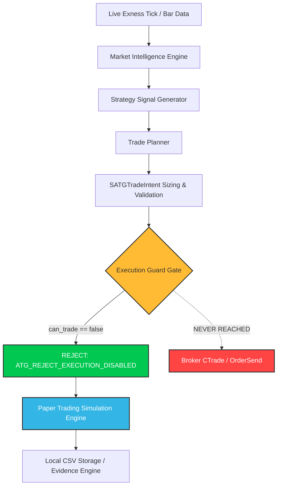
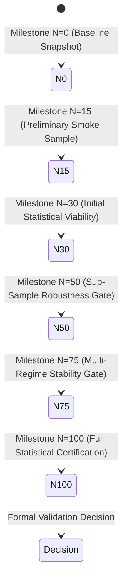

# Phase 10 Architecture: Forward Evidence Accumulation, Monitoring & Validation

## 1. Executive Summary & Objective

**Phase 10: Forward Evidence Accumulation, Monitoring & Validation** transitions the NeuroPip from initial framework verification into an autonomous, long-horizon forward-paper research and evidence accumulation engine operating in MetaTrader 5 (MT5). Attached to an Exness Demo account with live market data feeds across a 5-symbol universe (`BTCUSDm`, `EURUSDm`, `USDJPYm`, `XAUUSDm`, `ETHUSDm`), the engine systematically executes simulated paper trades while live broker execution remains **strictly disabled**.

The architectural objective of Phase 10 is to accumulate an unpolluted, statistically valid sample of genuine forward market trades without parameter tuning or curve-fitting, applying continuous forensic data quality checks, persistent multi-tier snapshot logging, and real-time operational diagnostics until sufficient evidence exists to reach formal validation decisions.

---

## 2. Hard Execution Isolation & Safety Constraints

Real broker order execution is prohibited. All trades generated during Phase 10 are candidate simulations executed in internal paper memory.

### Safety Guarantee Matrix



1. **`can_trade = false`**: Hardcoded capability flag across engine configuration and runtime state.
2. **`MODE_MONITOR_ONLY`**: Global operational state restricting all execution pipeline requests to read-only diagnostics and simulated paper fills.
3. **`CExecutionGuard` Hard Latch**: All live broker order requests submitted to `CExecutionGuard::Validate()` are unconditionally rejected with return code `ATG_REJECT_EXECUTION_DISABLED`.
4. **`candidate_only = true`**: Enforced on every trade plan, simulated order, and paper record.
5. **Zero Broker API Calls**: Total decoupling between the strategy/paper pipeline and MT5 broker APIs (`OrderSend`, `OrderSendAsync`, `CTrade::Buy`, `CTrade::Sell`). Broker execution calls do not exist in the paper execution pathway.

---

## 3. Forward Dataset Integrity & Segregation

To guarantee forensic purity, the forward evidence dataset is strictly separated from non-forward data sources.

### Dataset Classification Hierarchy

| Dataset Class (`ENUM_DATASET_CLASS`) | Description | Eligible for Forward Milestones? |
|---|---|:---:|
| `DATASET_FORWARD_LIVE_PAPER` | Genuine paper trades generated from live Exness streaming ticks/bars during live forward monitoring. | **YES** |
| `DATASET_SYNTHETIC_TEST` | Synthetic trades generated by unit tests, integration harnesses, or simulation fuzzing. | **NO (Quarantined)** |
| `DATASET_HISTORICAL_IMPORTED` | Backtest or historical bar replay data imported for calibration. | **NO (Quarantined)** |
| `DATASET_BOOTSTRAP_SAMPLE` | Resampled synthetic series from Monte Carlo or bootstrap routines. | **NO (Quarantined)** |

Any record arriving with `dataset_class != DATASET_FORWARD_LIVE_PAPER` is routed into isolated internal storage arrays, increments the `dataset_contamination_prevented` counter, and is never included in milestone snapshots or forward metrics.

### 20 Mandatory Forward Evidence Fields

Every genuine forward trade record persisted to `paper_trades_closed.csv` retains all 20 required forensic fields:
1. `paper_trade_id`: Unique 64-bit integer identifier
2. `symbol`: Trading instrument (e.g. `BTCUSDm`, `EURUSDm`)
3. `direction`: Order direction (`BUY` or `SELL`)
4. `entry_time`: High-resolution entry timestamp
5. `exit_time`: High-resolution exit timestamp
6. `entry_price`: Simulated fill price
7. `exit_price`: Simulated close price
8. `stop_loss`: Planned risk boundary price
9. `take_profit`: Planned reward target price
10. `risk_money`: Cash risk budget (allocated from $10.00 paper equity)
11. `net_pnl`: Realized net profit/loss in paper cash
12. `realized_r`: Realized gain/loss normalized in units of initial risk ($R$)
13. `strategy_id`: Canonical strategy identifier (`NEUROPIP_TREND_CONTINUATION`)
14. `config_fingerprint`: Deterministic 64-bit FNV-1a hash of active configuration
15. `regime`: Detected market regime at entry (e.g. `REGIME_TRENDING_BULLISH`)
16. `strategy_confidence`: Quantitative signal confidence score $[0.0, 1.0]$
17. `strategy_quality`: Multi-factor setup confluence score $[0.0, 1.0]$
18. `entry_spread_points`: Broker bid/ask spread measured at trade entry
19. `source_bar_time`: Exact timestamp of the bar generating the signal
20. `exit_reason`: Cause of position closure (`TP`, `SL`, `EXPIRED`, `EMERGENCY`)

---

## 4. Strategy Freeze & Anti-Tampering Protocol

During Phase 10, trading rules, risk parameters, and operational filters are frozen to eliminate observer bias, curve fitting, and post-hoc optimization.

### Frozen Strategy Contract

- **Strategy Engine**: Single-strategy focus on `NEUROPIP_TREND_CONTINUATION`.
- **Risk per Trade**: Exactly 1.0% of current paper equity ($0.10 risk budget on $10.00 equity).
- **Minimum Reward-to-Risk**: 1.50 $R$.
- **Stop Loss Distance**: 2.0x ATR(14) on entry timeframe (M15).
- **Take Profit Distance**: 2.0x Risk ($2.0 R$).
- **Multi-Timeframe Hierarchy**: M1 $\rightarrow$ M5 $\rightarrow$ M15 $\rightarrow$ H1 $\rightarrow$ H4 $\rightarrow$ D1.
- **Config Fingerprint**: Deterministic 64-bit FNV-1a hash: `FP-B741A5209E579706`.

### Anti-Tampering Latch

On every timer tick and trade evaluation, `CForwardEvidenceEngine::VerifyConfiguration()` recomputes the active configuration hash. If any parameter (risk percent, multipliers, spread tolerance, version) diverges:
1. `ALERT_CONFIG_MISMATCH` is dispatched at `CRITICAL` severity.
2. The active cohort status is latched to `COHORT_STATUS_INVALIDATED`.
3. An audit trail entry is persisted (`AUDIT_CONFIG_TAMPERING_DETECTED`).
4. All subsequent forward trade accumulation for that cohort is immediately halted.

---

## 5. Milestone Progression Schedule & Snapshot Specifications

Evidence accumulation is measured against an explicit milestone ladder.



### Snapshot Structure (`SForwardMilestoneSnapshot`)

At each milestone $N \in \{0, 15, 30, 50, 75, 100\}$, `GenerateMilestoneSnapshot()` records a 24-column snapshot persisted to `forward_milestone_snapshots.csv`:

1. `milestone_name`: Identifier (`N=0`, `N=15`, etc.)
2. `milestone_target`: Target integer count ($0, 15, \dots, 100$)
3. `timestamp`: Timestamp of milestone trigger
4. `cohort_id`: Active cohort identifier (`COHORT_01`)
5. `config_fingerprint`: Frozen configuration hash
6. `sample_size`: Total forward trades evaluated
7. `valid_records`: Clean, unflagged forward trades
8. `invalid_records`: Quarantined invalid trades
9. `warning_records`: Clean trades with non-fatal warnings
10. `win_rate`: Percentage of winning trades
11. `loss_rate`: Percentage of losing trades
12. `profit_factor`: Gross profit / Gross loss
13. `expectancy`: Average trade payoff in units of $R$
14. `average_r`: Arithmetic mean of realized $R$
15. `median_r`: Median (P50) of realized $R$
16. `maximum_drawdown`: Peak-to-valley equity decline ($)
17. `p95_drawdown`: 95th percentile drawdown from Monte Carlo resampling
18. `maximum_losing_streak`: Longest sequence of consecutive losses
19. `symbol_distribution`: Semicolon-delimited breakdown (`BTCUSDm:4;EURUSDm:5;...`)
20. `direction_distribution`: Directional breakdown (`BUY:8;SELL:7`)
21. `regime_distribution`: Market regime breakdown (`BULL:6;BEAR:5;RANGING:4`)
22. `confidence_quality_distribution`: Confidence and quality cross-tabulations
23. `temporal_distribution`: Trade count distribution by day of week and session
24. `data_quality_statistics`: Comprehensive summary of all 15 data health counters

---

## 6. Continuous Data-Quality Monitoring (15 Forensic Areas)

The engine monitors 15 distinct operational, market data, and persistence anomalies:

```
+-----------------------------------------------------------------------------------+
|                        15 DATA QUALITY MONITORING DOMAINS                         |
+------------------------------------+----------------------------------------------+
| 1. Missing Bars Detection          | 9.  Volume Sanity Check (< 0.01 lot)        |
| 2. Stale Market Data Detection     | 10. Persistence Failure Detection            |
| 3. Timestamp Discontinuities       | 11. Corrupted Forward Record Detection       |
| 4. Duplicate Trade ID Rejection    | 12. Unexpected State Resets                  |
| 5. Duplicate Source Bar Rejection  | 13. State Recovery Failures                  |
| 6. Invalid Price Levels (<= 0)     | 14. Config / Strategy Version Mismatches     |
| 7. Invalid SL / TP Geometry        | 15. Execution Safety Gate Violations         |
| 8. Non-Positive Risk Allocation    |                                              |
+------------------------------------+----------------------------------------------+
```

Every rejected trade is quarantined in memory, emitted via `CForwardAlertManager`, recorded with an explicit reason string, and logged to `audit_trail.csv`. No trade is silently discarded or repaired.

---

## 7. Multi-Tier Periodic Persistent Snapshots

The engine maintains 3 persistent time-series snapshot tables in `MQL5/Files/NeuroPip_EA/Persistence/`:

1. **Daily Snapshots (`forward_daily_snapshots.csv`)**:
   - Schema: `date_key,timestamp,cohort_id,trades_generated,trades_closed,sample_size,pnl,realized_r,drawdown,drawdown_pct,data_health,persistence_health,anomalies_count,anomalies_summary`
   - Generated daily at midnight or on session close.

2. **Weekly Snapshots (`forward_weekly_snapshots.csv`)**:
   - Schema: `week_key,timestamp,cohort_id,cumulative_trades,cumulative_pnl,cumulative_r,win_rate,profit_factor,regime_breakdown,symbol_breakdown,drawdown,max_win_streak,max_loss_streak,evidence_quality,changes_from_prev_week`
   - Summarizes cumulative trajectory and cross-symbol/regime shifts.

3. **Monthly Validation Snapshots (`forward_monthly_snapshots.csv`)**:
   - Schema: `month_key,timestamp,cohort_id,total_trades,win_rate,profit_factor,expectancy,sharpe_ratio,sortino_ratio,robustness_survival,evidence_class,recommendation`
   - Re-evaluates all forward data using Phase 8 `CStatisticalEvaluationEngine` and outputs formal recommendation (`CONTINUE_COLLECTING`, `EVALUATE_NEXT_GATE`, `HALT_SYSTEM`).

---

## 8. Diagnostic Alert Management Architecture

`CForwardAlertManager` routes diagnostic events across 9 structured categories:

```
[Anomaly Detected]
       |
       v
CForwardAlertManager::EmitAlert()
       |
       +---> Increment per-category & total anomaly counters
       +---> Ring-buffer storage (last 32 alert records for UI / queries)
       +---> Structured diagnostic logging: [SEVERITY] from [SOURCE]: [MESSAGE]
       +---> Audit trail append: AUDIT_ALERT_TRIGGERED in audit_trail.csv
```

Alert categories:
- `ALERT_PERSISTENCE_FAILURE` (`CRITICAL`)
- `ALERT_DATA_FEED_FAILURE` (`CRITICAL`)
- `ALERT_UNEXPECTED_STATE_RESET` (`CRITICAL`)
- `ALERT_CORRUPT_FORWARD_RECORD` (`WARNING`)
- `ALERT_RISK_CONTRACT_VIOLATION` (`CRITICAL`)
- `ALERT_CONFIG_MISMATCH` (`CRITICAL`)
- `ALERT_EXECUTION_SAFETY_VIOLATION` (`CRITICAL`)
- `ALERT_LARGE_DRAWDOWN` (`WARNING`)
- `ALERT_UNEXPECTED_BEHAVIOR` (`NOTICE`)

Alerts are purely diagnostic. They **never** trigger automatic strategy adjustments.

---

## 9. Restart & Recovery Architecture

To survive terminal crashes, VPS reboots, and EA reloads:
1. **Active Paper Trades**: Serialized to `paper_trades_active.csv`. On startup, open positions are restored into memory with identical entry price, stop loss, take profit, and initial risk money.
2. **Closed Paper Trades**: Serialized to `paper_trades_closed.csv`. On startup, closed trades are reloaded and deduplicated against existing records.
3. **Cohort Metadata**: State counters (`valid_trades`, `invalid_trades`, `milestone`, `status`) are reconstructed directly from loaded trade history.
4. **Equity History**: `equity_history.csv` maintains continuity across restarts without resetting the high watermark or starting capital.
5. **Snapshots**: Loaded from disk on engine initialization so previous daily, weekly, monthly, and milestone snapshots remain intact.

---

## 10. Small-Account Scale Feasibility ($10.00 Paper Account)

To evaluate how position sizing and risk behave at micro scale:
- Forward simulation account balance: **$10.00 USD**.
- Risk budget per trade: **$0.10 USD** (1.0% of $10.00).
- Broker minimum lot constraint: **0.01 lot**.
- Broker leverage & lot step constraints: Enforced via `CPositionSizer`.
- **Sub-minimum Volume Protection**: If a 0.01 lot position would incur a loss greater than the allowed risk budget ($0.10), the trade is safely rejected. Volume is **never** artificially rounded up to 0.01 lot to force an execution.
