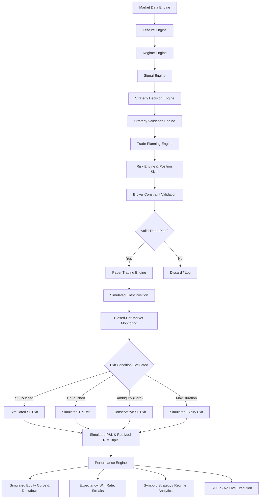

# Phase 6 — Paper Trading, Trade Simulation & Performance Engine

## Absolute Safety Requirement & Boundary

> [!CAUTION]
> **PHASE 6 IS PAPER TRADING ONLY. NO LIVE ORDERS ARE POSSIBLE.**
> 
> Under zero circumstances does Phase 6 create, submit, or execute real broker orders.
> - `can_trade = false` is strictly enforced.
> - `MONITOR_ONLY = true` is hard-locked.
> - Zero calls to `OrderSend()`, `CTrade.Buy()`, `CTrade.Sell()`, or `PositionOpen()`.
> - `CExecutionGuard` remains permanently active and hard-locked.
> - The Paper Trading and Trade Simulation Engine is fully separated from the live broker execution pipeline.

---

## Architecture Overview

Phase 6 implements a deterministic Paper Trading, Trade Simulation, and Real-Time Performance Engine that evaluates how Phase 5 Trade Plans would perform under live market conditions without financial risk:

---

## Paper Trade Data Contract

The paper trade data contract is defined in [`Simulation/PaperTradeTypes.mqh`](file:///c:/Users/biduo/Downloads/Forex%20Bot/mt5/NeuroPip_EA/Simulation/PaperTradeTypes.mqh):

### Status Enum: `ENUM_PAPER_TRADE_STATUS`
- `PAPER_PENDING`: Order plan received, awaiting simulated fill.
- `PAPER_OPEN`: Order filled at planned entry; active simulated position.
- `PAPER_CLOSED_TP`: Closed upon touching planned Take Profit.
- `PAPER_CLOSED_SL`: Closed upon touching planned Stop Loss.
- `PAPER_CLOSED_EXPIRY`: Closed upon exceeding maximum holding duration or plan expiration.
- `PAPER_CLOSED_INVALIDATION`: Cancelled due to structure invalidation before entry.
- `PAPER_CANCELLED`: Cancelled manually or by upstream pipeline.
- `PAPER_REJECTED`: Rejected due to validation failure or duplicate prevention.

### Structured Record: `SPaperTrade`
Captures 30+ standardized fields for complete explainability and auditability:
- **Identification**: `paper_trade_id` (unique monotonic ID), `source_plan_id` (Phase 5 plan ID), `strategy_id` (`"NEUROPIP_TREND_CONTINUATION"`).
- **Market Context**: `symbol`, `direction`, `primary_timeframe`, `regime` (from Phase 3), `strategy_confidence`, `strategy_quality`.
- **Timing**: `entry_time`, `exit_time`, `source_bar_time`, `holding_duration_sec`.
- **Pricing**: `entry_price` (exact planned entry), `stop_loss`, `take_profit`, `exit_price`, `spread_entry`.
- **Sizing & Risk**: `volume` (exact Phase 5 normalized lot size), `risk_money`, `equity_at_entry`, `risk_percent`, `planned_rr`.
- **Performance & P&L**: `gross_pnl`, `simulated_costs`, `net_pnl`, `realized_r` ($P\&L / RiskMoney$).
- **Excursion Metrics**: `mae_points` (Maximum Adverse Excursion), `mfe_points` (Maximum Favorable Excursion).
- **Diagnostics**: `status`, `exit_reason`, `explanation`, `formatted_trade`.

---

## Simulated Entry Model

- **Exact Price Preservation**: The simulated entry price matches the exact planned entry price generated by Phase 5 Trade Planning (`plan.entry_price`). The simulator does not recalculate or manipulate entry prices.
- **Fill Assumption**: In Phase 6, valid plans are filled at the planned entry price immediately upon bar confirmation. This simulation assumption is explicitly logged (`execution_is_simulation = true`).
- **One Position Per Symbol**: To avoid unconstrained duplicate simulations on the same instrument, the engine prevents opening a second concurrent paper trade on a symbol while one is already active.

---

## Simulated Exit Model & Monitoring

Positions are evaluated strictly on **closed bars** (`CBarDataManager`) to eliminate look-ahead bias and intrabar repaint artifacts:

- **BUY Exit Rules**:
  - If `bar.low <= stop_loss` $\rightarrow$ Exit at `stop_loss`.
  - Else if `bar.high >= take_profit` $\rightarrow$ Exit at `take_profit`.
- **SELL Exit Rules**:
  - If `bar.high >= stop_loss` $\rightarrow$ Exit at `stop_loss`.
  - Else if `bar.low <= take_profit` $\rightarrow$ Exit at `take_profit`.
- **Holding Expiration**:
  - If position elapsed duration exceeds `m_max_holding_sec` (default: 7200 seconds / 2 hours), the position is liquidated at `bar.close` with exit reason `EXIT_REASON_EXPIRY`.

---

## Same-Bar SL/TP Ambiguity Policy

> [!IMPORTANT]
> **Deterministic Conservative Policy**: When both Stop Loss and Take Profit fall within the price range of a single candle (`bar.low <= SL && bar.high >= TP` for BUY, or `bar.high >= SL && bar.low <= TP` for SELL), OHLC candle data cannot ascertain whether SL or TP was reached first.
>
> The NeuroPip implements a **strictly conservative policy**:
> - It **assumes the Stop Loss was hit first**.
> - Exit price is set to `stop_loss`.
> - Status is set to `PAPER_CLOSED_SL`.
> - Exit reason is explicitly recorded as `SAME_BAR_AMBIGUITY_CONSERVATIVE_SL`.
> - Logged with `LOG_LEVEL_WARNING`.

This prevents optimistic bias and avoids overstating strategy performance.

---

## P&L & R-Multiple Economics

1. **Broker Economics Calculation**:
   - Primary: Uses MT5 native `OrderCalcProfit(order_type, symbol, volume, entry_price, exit_price, profit)`.
   - Fallback: Uses broker tick economics (`SYMBOL_TRADE_TICK_SIZE` and `SYMBOL_TRADE_TICK_VALUE`).
2. **Realized R-Multiple Formula**:
   $$R = \frac{\text{Net P\&L}}{\text{Planned Risk Money}}$$
   - Example winning trade: $+\$20.00 / \$10.00 = +2.00R$.
   - Example losing trade: $-\$10.00 / \$10.00 = -1.00R$.
3. **Simulated Costs**:
   - `simulation_cost_model = ZERO_COST_DEMO`
   - Spread is captured at entry; commissions and swap are zeroed in this initial demo model.
4. **Slippage**:
   - `slippage_model = NONE`
   - Fills occur at exact planned/trigger levels. No synthetic random slippage is injected.

---

## Simulated Equity Curve & Drawdown Tracking

1. **Independent Paper Equity**:
   - Default starting balance: `initial_paper_equity = $1000.00` (configurable via `Config.mqh`).
   - The broker's live account balance is completely untouched.
2. **Equity Progression**:
   $$\text{Current Equity}_{t} = \text{Current Equity}_{t-1} + \text{Net P\&L}_{t}$$
3. **Peak Equity & Drawdown**:
   $$\text{Peak Equity} = \max(\text{Peak Equity}, \text{Current Equity})$$
   $$\text{Drawdown (\%)} = \frac{\text{Peak Equity} - \text{Current Equity}}{\text{Peak Equity}} \times 100\%$$
   $$\text{Max Drawdown} = \max(\text{Max Drawdown}, \text{Current Drawdown})$$

---

## Performance Engine Metrics

[`Simulation/PerformanceEngine.mqh`](file:///c:/Users/biduo/Downloads/Forex%20Bot/mt5/NeuroPip_EA/Simulation/PerformanceEngine.mqh) tracks:
- **Totals**: Total trades, winning trades, losing trades, breakeven trades.
- **Rates**: Win rate ($\%$) and Loss rate ($\%$).
- **Financials**: Gross profit, gross loss, net P&L, profit factor ($GrossProfit / GrossLoss$).
- **R-Multiples**: Total R, Average Win R, Average Loss R, Average Trade R.
- **Expectancy**:
  $$\text{Expectancy} = (\text{Win Rate} \times \text{Average Win R}) - (\text{Loss Rate} \times \text{Average Loss R})$$
- **Extrema & Streaks**: Largest win ($\$$), largest loss ($\$$), current win/loss streak, max win/loss streak.
- **Duration**: Average holding duration in seconds.

---

## Multi-Dimensional Analytics

The performance engine decomposes results across three distinct dimensions:
1. **Symbol Breakdown**: Tracked separately for `EURUSDm`, `USDJPYm`, `XAUUSDm`, `BTCUSDm`, `ETHUSDm`.
2. **Strategy Breakdown**: Tracked by Strategy ID (`"NEUROPIP_TREND_CONTINUATION"`). Extensible for future strategies.
3. **Market Regime Breakdown**: Tracked across 7 market regimes (`REGIME_TRENDING_BULLISH`, `REGIME_TRENDING_BEARISH`, `REGIME_RANGING`, `REGIME_HIGH_VOLATILITY`, `REGIME_LOW_VOLATILITY`, `REGIME_TRANSITION`, `REGIME_INSUFFICIENT_DATA`).

---

## Sample Size Threshold & Statistical Warnings

To prevent false conclusions from small data samples:
- Threshold: `min_performance_sample = 30 trades` (configurable).
- State `< 30 trades`: `INSUFFICIENT_SAMPLE`. The engine refuses to display misleading performance claims.
- State $\ge 30$ trades: `PERFORMANCE_SAMPLE_READY`.
- **Note**: 30 trades is a preliminary reporting threshold, not statistical proof of live production viability.

---

## State Persistence & Lifecycle Limitations

- **In-Memory State**: Phase 6 maintains paper trades and the equity curve in volatile memory. State resets on EA reinitialization/terminal restart.
- **No Durable Storage**: SQLite / binary file persistence will be introduced in subsequent phases.
- **Duplicate Prevention**: In-memory plan ID registry (`IsPlanSimulated`) prevents duplicate simulation of the same Phase 5 Trade Plan.

---

## Automated Test Suite (25 Tests)

[`Tests/Phase6Tests.mqh`](file:///c:/Users/biduo/Downloads/Forex%20Bot/mt5/NeuroPip_EA/Tests/Phase6Tests.mqh) verifies all 25 critical Phase 6 simulation requirements:
1. Valid BUY paper trade creation
2. Valid SELL paper trade creation
3. BUY Take Profit hit detection
4. BUY Stop Loss hit detection
5. SELL Take Profit hit detection
6. SELL Stop Loss hit detection
7. Same-bar SL/TP ambiguity conservative SL enforcement
8. Trade expiration handling
9. Invalid plan rejection
10. Duplicate simulation prevention
11. Broker economics P&L calculation
12. Realized R-multiple calculation
13. Simulated equity update
14. Maximum drawdown tracking
15. Win rate calculation
16. Profit factor calculation
17. Expectancy calculation
18. Winning streak tracking
19. Losing streak tracking
20. Symbol-level performance aggregation
21. Strategy-level performance aggregation
22. Regime-level performance aggregation
23. Insufficient sample size reporting
24. Execution safety barrier verification (`can_trade == false`)
25. Regression verification of Phases 1 through 5 contracts
