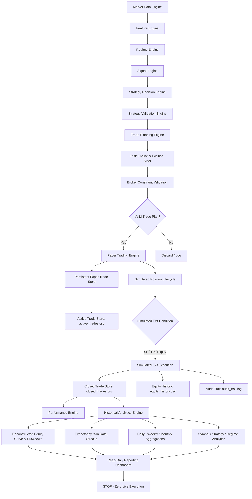

# Phase 7 — Persistent Paper Trading & Historical Analytics

## Absolute Safety Requirement & Boundary

> [!CAUTION]
> **PHASE 7 PERSISTENCE IS EXCLUSIVELY FOR SIMULATED PAPER TRADING. LIVE TRADING IS HARD-LOCKED.**
> 
> - `can_trade = false` remains strictly enforced at all compilation, initialization, and runtime stages.
> - `MONITOR_ONLY = true` is permanently locked.
> - `CExecutionGuard` remains permanently active and hard-locked.
> - Zero live order execution (`OrderSend`, `CTrade.Buy`, `CTrade.Sell`, `PositionOpen`, or equivalent) exists anywhere in this phase.
> - Persistence failure or storage corruption NEVER falls through to live trading.
> - Real broker balances, accounts, and order books remain 100% untouched.

---

## Architecture Overview

Phase 7 upgrades the Phase 6 paper-trading simulation into a durable, recoverable, crash-resilient storage and historical analytics architecture:

---

## Persistence Design & Storage Engine

### MQL5 Native File Storage
The persistence subsystem is implemented in [`Persistence/PaperTradeStorage.mqh`](file:///c:/Users/biduo/Downloads/Forex%20Bot/mt5/ATG_TradingEngine/Persistence/PaperTradeStorage.mqh) using standard, native MQL5 File I/O functions (`FileOpen`, `FileWriteString`, `FileReadString`, `FileClose`).

- **Base Directory**: `MQL5\Files\ATG_Simulation\` (sandboxed to MT5 data folder).
- **Format**: Structured Delimited CSV tables with explicit `# SCHEMA_VERSION: 1` header comments.
- **Dependency-Free**: Zero external database binaries, DLLs, or third-party wrappers required. Fully portable across standard MT5 instances.

### Managed Storage Files
1. **`active_trades.csv`**: Active open paper trade records.
   - Re-written atomically on position open and close.
   - Employs a staging file (`active_trades.tmp`) and atomic file replacement (`FileDelete` + `FileMove` / rename) to prevent partial write corruption if the terminal crashes or powers down mid-write.
2. **`closed_trades.csv`**: Append-only log of all closed paper trades.
   - Every closed trade appends a complete 31-token CSV record.
   - Never truncated or overwritten during normal operation.
3. **`equity_history.csv`**: Time-series log of simulated equity snapshots.
   - Appended on major simulation lifecycle milestones (`INITIAL_BALANCE`, `TRADE_OPEN`, `TRADE_CLOSE`).
   - Tracks timestamp, event, trade ID, equity, balance, peak equity, drawdown money, drawdown percentage, realized P&L, and realized R.
4. **`audit_trail.log`**: Human- and machine-readable audit trail.
   - Appends timestamps, event codes (`AUDIT_PAPER_TRADE_OPENED`, `AUDIT_PAPER_TRADE_CLOSED`, `AUDIT_SAME_BAR_AMBIGUITY`, etc.), trade IDs, symbols, and event details.

---

## Schema Specification (Version 1)

Every persisted file begins with the schema header:
`# SCHEMA_VERSION: 1`

### Paper Trade Record Schema (`SPaperTrade` — 31 Fields)
| # | Field | Type | Description |
|---|---|---|---|
| 0 | `paper_trade_id` | ulong | Deterministic monotonic trade ID |
| 1 | `source_plan_id` | ulong | Phase 5 Trade Plan ID |
| 2 | `strategy_id` | string | Strategy name (`"ATG_TREND_CONTINUATION"`) |
| 3 | `symbol` | string | Broker symbol name (e.g. `"EURUSDm"`) |
| 4 | `direction` | int | `0 = BUY`, `1 = SELL` |
| 5 | `primary_timeframe` | int | Primary analysis timeframe |
| 6 | `entry_time` | datetime | Simulated open timestamp |
| 7 | `exit_time` | datetime | Simulated close timestamp |
| 8 | `source_bar_time` | datetime | Underlying signal candle time |
| 9 | `holding_duration_sec` | int | Total trade holding duration in seconds |
| 10 | `entry_price` | double | Simulated fill entry price |
| 11 | `stop_loss` | double | Planned protective stop price |
| 12 | `take_profit` | double | Planned target price |
| 13 | `exit_price` | double | Simulated exit price |
| 14 | `spread_entry` | double | Recorded spread at fill |
| 15 | `slippage_points` | double | Realized slippage (0.0 in demo model) |
| 16 | `volume` | double | Normalized position volume (lots) |
| 17 | `risk_money` | double | Planned cash risk amount ($) |
| 18 | `equity_at_entry` | double | Paper equity at trade entry ($) |
| 19 | `risk_percent` | double | Planned percentage equity risk (%) |
| 20 | `planned_rr` | double | Planned Reward-to-Risk ratio |
| 21 | `gross_pnl` | double | Gross simulated profit/loss ($) |
| 22 | `simulated_costs` | double | Simulated transaction costs ($) |
| 23 | `net_pnl` | double | Net simulated profit/loss ($) |
| 24 | `realized_r` | double | Net P&L divided by Planned Risk Money |
| 25 | `mae_points` | double | Maximum Adverse Excursion (pts) |
| 26 | `mfe_points` | double | Maximum Favorable Excursion (pts) |
| 27 | `status` | int | Status code (`ENUM_PAPER_TRADE_STATUS`) |
| 28 | `exit_reason` | string | Sanitized exit reason string |
| 29 | `strategy_confidence` | double | Strategy confidence score [0.0, 1.0] |
| 30 | `strategy_quality` | double | Multi-gate strategy quality score [0.0, 1.0] |
| 31 | `candidate_only` | int | **Safety flag: 1 = TRUE (Enforced)** |

---

## Active Trade Recovery & Restart Resilience

On EA initialization (`CPaperTradingEngine::Initialize()`):
1. **Storage Health Verification**: Verifies storage folder accessibility.
2. **Active Trades Loading**: Reads `active_trades.csv` line by line.
3. **Data Integrity & Validation**:
   - Parses each record via `SPaperTrade::FromCsv()`.
   - Rejects corrupted or malformed lines without crashing.
   - Enforces `candidate_only == 1`, positive volumes, and valid prices.
4. **Duplicate Prevention**: Ignores records with duplicate trade IDs.
5. **Counter Restoration**: Scans all active and historical trade IDs to ensure `m_trade_counter` is strictly greater than `max(existing_ids) + 1`, eliminating duplicate ID generation.
6. **Continuous Simulation**: Restored active trades resume closed-bar evaluation immediately upon subsequent ticks/bars.

---

## Historical Performance & Multi-Period Analytics

Phase 7 implements [`Persistence/HistoricalAnalyticsEngine.mqh`](file:///c:/Users/biduo/Downloads/Forex%20Bot/mt5/ATG_TradingEngine/Persistence/HistoricalAnalyticsEngine.mqh), providing comprehensive performance reconstruction from persisted history.

### Analytics Metric Suite
- **Overall Statistics**: Total trades, wins, losses, breakevens, win rate, loss rate, gross profit, gross loss, net P&L, profit factor, average win, average loss, average R, mathematical expectancy ($R$), maximum drawdown ($ & %), winning streak, losing streak, average duration, longest duration.
- **Categorical Breakdowns**:
  - By Symbol (EURUSDm, USDJPYm, XAUUSDm, BTCUSDm, ETHUSDm).
  - By Strategy (e.g. `ATG_TREND_CONTINUATION`).
  - By Market Regime (e.g. `TRENDING_BULL_STRONG`, `RANGING_COMPRESSED`).
- **Periodic Aggregations**:
  - **Daily Breakdown**: Aggregated by ISO date key (`YYYY-MM-DD`).
  - **Weekly Breakdown**: Aggregated by year-week key (`YYYY-Www`).
  - **Monthly Breakdown**: Aggregated by year-month key (`YYYY-MM`).

### Minimum Sample Protection
The engine implements strict statistical safeguards:
- Requires a minimum sample size (default: 30 closed trades) before reporting metrics as statistically meaningful.
- Displays `INSUFFICIENT_SAMPLE` warning banner in diagnostic reports until threshold is attained.

---

## Audit Trail

All critical simulation and persistence lifecycle transitions are logged to `MQL5\Files\ATG_Simulation\audit_trail.log`:
- `PAPER_TRADE_CREATED`: Trade plan converted to pending paper trade.
- `PAPER_TRADE_OPENED`: Paper trade simulated fill completed.
- `PAPER_TRADE_CLOSED`: Paper position closed.
- `PAPER_TRADE_TP`: Take profit hit.
- `PAPER_TRADE_SL`: Stop loss hit.
- `PAPER_TRADE_EXPIRED`: Maximum holding duration reached.
- `SAME_BAR_AMBIGUITY`: Same-bar SL/TP collision resolved with conservative SL.
- `PERSISTENCE_LOAD`: Active or closed trades loaded from storage.
- `PERSISTENCE_SAVE`: Active trades or closed record saved to disk.
- `PERSISTENCE_ERROR`: File write or read operation error detected.
- `RECOVERY_SUCCESS`: Active trades recovered after restart.
- `RECOVERY_REJECTED`: Corrupted or invalid trade rejected during recovery.

---

## Data Integrity & Safe Failures

1. **No Silent Fallback to Live**: Any persistence failure only affects simulated paper trade storage. Live trading is never enabled.
2. **String Sanitization**: Commas, carriage returns, and linefeeds are stripped from string fields before writing to prevent CSV delimiter corruption.
3. **Atomic Writes**: `active_trades.csv` is written to a `.tmp` file and atomically renamed to prevent truncation or empty files during abnormal system shutdowns.
4. **Safety Assertion in Parser**: If a CSV record lacks `candidate_only == 1`, `FromCsv()` rejects the record immediately.

---

## Testing Verification

The test suite in [`Tests/Phase7Tests.mqh`](file:///c:/Users/biduo/Downloads/Forex%20Bot/mt5/ATG_TradingEngine/Tests/Phase7Tests.mqh) comprises **32 comprehensive tests**:

| Test ID | Description | Result |
|---|---|---|
| Test 01 | Persistence initialization | PASS |
| Test 02 | Empty database / storage handling | PASS |
| Test 03 | Trade save serialization | PASS |
| Test 04 | Trade load deserialization | PASS |
| Test 05 | Active trade recovery | PASS |
| Test 06 | Closed trade persistence | PASS |
| Test 07 | Duplicate trade prevention | PASS |
| Test 08 | Malformed record handling | PASS |
| Test 09 | Schema versioning handling | PASS |
| Test 10 | Partial / corrupt write rejection | PASS |
| Test 11 | Equity point persistence | PASS |
| Test 12 | Drawdown persistence | PASS |
| Test 13 | Overall performance reconstruction | PASS |
| Test 14 | Symbol analytics reconstruction | PASS |
| Test 15 | Strategy analytics reconstruction | PASS |
| Test 16 | Regime analytics reconstruction | PASS |
| Test 17 | Daily time-period aggregation | PASS |
| Test 18 | Weekly time-period aggregation | PASS |
| Test 19 | Monthly time-period aggregation | PASS |
| Test 20 | Audit trail logging | PASS |
| Test 21 | Restart simulation & recovery | PASS |
| Test 22 | Multi-active trade recovery | PASS |
| Test 23 | Recovery with closed history & counter restore | PASS |
| Test 24 | Persistence disabled behavior | PASS |
| Test 25 | Minimum sample size protection | PASS |
| Test 26 | Safety boundary (Zero Live Orders) | PASS |
| Test 27 | Phase 1 Regression (Market Data) | PASS |
| Test 28 | Phase 2 Regression (Execution Guard & Sizer) | PASS |
| Test 29 | Phase 3 Regression (Market Intelligence) | PASS |
| Test 30 | Phase 4 Regression (Strategy Decision) | PASS |
| Test 31 | Phase 5 Regression (Trade Planning) | PASS |
| Test 32 | Phase 6 Regression (Simulation Engine) | PASS |

---

## Known Limitations & Future Roadmap

1. **Terminal File Sandboxing**: MQL5 files are sandboxed to `MQL5\Files`. To export analytics outside MT5, external scripts or standard file replication tools can monitor the folder.
2. **Sequential CSV Scanning**: Current implementation parses CSV files sequentially. For historical record sets exceeding 100,000 trades, an indexed SQLite storage format (`DatabaseOpen`, `DatabaseExecute`) can be introduced in a future schema migration (`SCHEMA_VERSION: 2`).
3. **Schema Migration Strategy**: Future schema versions will check the `# SCHEMA_VERSION: X` header and invoke safe schema migrators to backfill fields without data loss.
