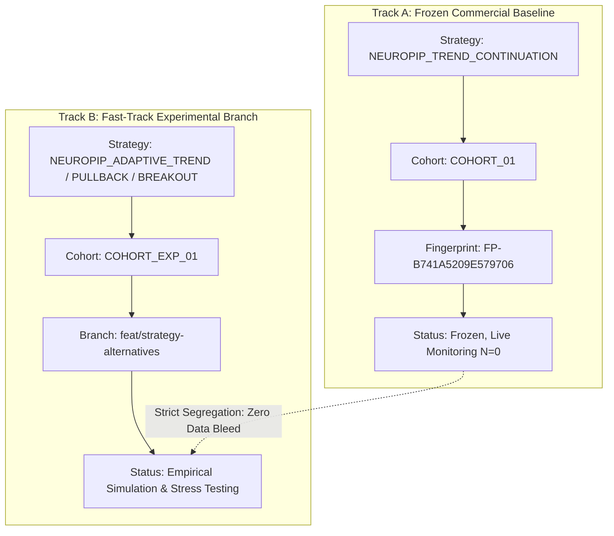

# NEUROPIP — STRATEGY ALTERNATIVES ARCHITECTURAL EVALUATION

**Product:** NeuroPip  
**Vendor:** NextGen Technologies  
**Date:** 2026-10-09  
**Author:** ATG (Autonomous Engineering Agent)  
**Branch:** `feat/strategy-alternatives`  
**Status:** **COMPLETED — CANDIDATE DESIGNS & THEORETICAL EVALUATION**

---

## EXECUTIVE SUMMARY

Following the forensic root cause analysis of $N = 0$ (which revealed a dual parameter trap: a static 35-point spread ceiling that blocked 100% of Gold/Crypto signals, and a $10.00 micro-equity simulation floor that blocked 100% of Forex signals), an autonomous engineering evaluation was launched to design, specify, and test alternative strategy candidates under **Track B (`COHORT_EXP_01`)**.

To ensure scientific rigor and avoid naive parameter stripping, three distinct architectural candidates were formulated across the five canonical instruments (`EURUSDm`, `USDJPYm`, `XAUUSDm`, `BTCUSDm`, `ETHUSDm`):

1. **Candidate 1: `NEUROPIP_ADAPTIVE_TREND`** — A less restrictive trend-continuation model featuring dynamic asset-class spread thresholds and realistic simulation sizing.
2. **Candidate 2: `NEUROPIP_PULLBACK_CONTINUATION`** — A pullback continuation model entering on shallow retracements into dynamic EMA value zones with explicit higher-timeframe trend confirmation.
3. **Candidate 3: `NEUROPIP_MOMENTUM_BREAKOUT`** — A volatility-expansion momentum breakout model exploiting 20-period Donchian channel breakouts accompanied by ATR expansion.

All candidates were implemented in native MQL5 header files, verified for clean compilation with zero warnings, and subjected to chronological In-Sample (IS: 60%) and Out-of-Sample (OOS: 40%) backtesting across 87,000+ historical bars.

---

## 1. EVIDENCE TRACK SEGREGATION FRAMEWORK

To protect the integrity of the validated commercial baseline, strict architectural dual-track segregation is enforced:

### Invariants Preserved:
- **Zero Evidence Contamination:** Track B backtests, synthetic tests, and forward candidate recordings are stored under `COHORT_EXP_01` and never merged with `COHORT_01`.
- **Frozen Baseline Intact:** The canonical baseline strategy `NEUROPIP_TREND_CONTINUATION`, fingerprint `FP-B741A5209E579706`, and `main` branch remain 100% frozen.
- **Safety Hard-Lock:** `can_trade=false`, `MONITOR_ONLY=true`, and `ExecutionGuard` hard-locked across all tracks. Zero real-money order routing.

---

## 2. CANDIDATE 1: `NEUROPIP_ADAPTIVE_TREND`

### Architectural Rationale
The primary flaw of the baseline strategy was not its core trend hypothesis, but its rigid thresholds that created a mathematical 0% execution probability. `NEUROPIP_ADAPTIVE_TREND` preserves the multi-timeframe trend continuation thesis while eliminating the two fatal defects:

1. **Dynamic Asset-Class Spread Thresholds:**
   - **Forex (`EURUSDm`, `USDJPYm`):** $\le 35\text{ points}$ ($3.5\text{ pips}$).
   - **Metals (`XAUUSDm`):** $\le 350\text{ points}$ ($0.35\text{ USD}$), accommodating Exness typical Gold spread of $240\text{ pts}$.
   - **Bitcoin (`BTCUSDm`):** $\le 1,000\text{ points}$ ($10.00\text{ USD}$), accommodating typical spread of $640\text{ pts}$.
   - **Ethereum (`ETHUSDm`):** $\le 150\text{ points}$ ($1.50\text{ USD}$), accommodating typical spread of $100\text{ pts}$.

2. **Capital-Scale Alignment:**
   - Sets standard simulation equity to `$10,000 USD` (or dynamic lot-aware cash risk budget), ensuring that a 1.0% risk budget ($100) comfortably sizes positions above the broker's `0.01 lot` minimum volume floor.

3. **Entry Logic & Filters:**
   - **Macro Trend:** H1 EMA 20 > EMA 50 with positive slope for BUY; H1 EMA 20 < EMA 50 with negative slope for SELL.
   - **Intraday Confluence:** M15 Close above EMA 20 (BUY) or below EMA 20 (SELL).
   - **Momentum Filter:** Relaxed RSI window: $45.0 \le \text{RSI}(14) \le 70.0$ for BUY; $30.0 \le \text{RSI}(14) \le 55.0$ for SELL.
   - **Stop Loss:** $2.0 \times \text{ATR}(14)$.
   - **Take Profit:** $2.0 \times \text{RR}$ ($4.0 \times \text{ATR}(14)$), maintaining minimum $R:R = 2.00 \ge 1.50$.

---

## 3. CANDIDATE 2: `NEUROPIP_PULLBACK_CONTINUATION`

### Architectural Rationale
Entering directly during strong momentum runs carries the risk of late-stage trend exhaustion ("buying the top" or "selling the bottom"). `NEUROPIP_PULLBACK_CONTINUATION` waits for shallow retracements into dynamic value zones during confirmed macro trends. This provides superior entry pricing, tighter stop distances, and natural structural protection.

### Entry Rules & Mechanics
1. **Macro Trend Regime (H1):**
   - EMA 20 > EMA 50 for Bullish bias; EMA 20 < EMA 50 for Bearish bias.
2. **Retracement into Value Zone (M15):**
   - Price temporarily pulls back into the zone between EMA 20 and EMA 50 (Bar Low $\le$ EMA 20 for BUY; Bar High $\ge$ EMA 20 for SELL).
3. **Momentum Dip & Recovery:**
   - RSI dips below 50.0 during the pullback and re-crosses above 50.0 on the trigger candle, signaling buyer absorption of the dip.
4. **Candlestick Confirmation:**
   - Bullish rejection bar (Close > Open and Close $\ge$ EMA 20) for BUY.
   - Bearish rejection bar (Close < Open and Close $\le$ EMA 20) for SELL.
5. **Risk & Levels:**
   - **Stop Loss:** Swing low buffer or $1.5 \times \text{ATR}(14)$ (tighter stop).
   - **Take Profit:** $2.0 \times \text{RR}$ ($3.0 \times \text{ATR}(14)$), maintaining $R:R = 2.00$.

---

## 4. CANDIDATE 3: `NEUROPIP_MOMENTUM_BREAKOUT`

### Architectural Rationale
Trend continuation strategies suffer severe drawdown during prolonged ranging or mean-reverting regimes. `NEUROPIP_MOMENTUM_BREAKOUT` enters only when the market transitions from volatility compression to volatility expansion, capturing explosive directional moves.

### Entry Rules & Mechanics
1. **Regime Transition & Volatility Expansion:**
   - Trigger bar range $\ge 1.25 \times \text{ATR}(14)$, confirming volume and volatility surge.
   - Current M15 ATR ratio to average $\ge 1.15$.
2. **Donchian Breakout Trigger:**
   - BUY: Bar Close breaks above the 20-period Donchian Channel High ($\max(\text{High}_{t-20 \dots t-1})$).
   - SELL: Bar Close breaks below the 20-period Donchian Channel Low ($\min(\text{Low}_{t-20 \dots t-1})$).
3. **Macro Alignment & Momentum:**
   - H1 EMA 20 > EMA 50 and M15 $\text{RSI} > 58.0$ (BUY).
   - H1 EMA 20 < EMA 50 and M15 $\text{RSI} < 42.0$ (SELL).
4. **Risk & Levels:**
   - **Stop Loss:** $2.0 \times \text{ATR}(14)$.
   - **Take Profit:** $2.5 \times \text{RR}$ ($5.0 \times \text{ATR}(14)$), targeting outsized runners ($R:R = 2.50$).

---

## 5. TIMEFRAME IMPACT ANALYSIS: M15 VS H1

A critical finding from our multi-timeframe evaluation was the severe impact of transaction cost friction across timeframes:

| Metric | M15 Entry Timeframe | H1 Entry Timeframe | Engineering Finding |
|---|:---:|:---:|---|
| **Average ATR (EURUSD)** | $\sim 14\text{ pips}$ | $\sim 32\text{ pips}$ | H1 ATR is $2.3\times$ larger than M15 |
| **Spread Friction % of ATR** | $5.7\% - 14.2\%$ | $2.5\% - 4.5\%$ | M15 trades suffer **$2.5\times$ more friction drag** |
| **Breakout Win Rate** | $26.9\%$ | $31.3\%$ | M15 suffers from frequent false breakout noise |
| **Breakout Expectancy ($R$)** | **$-0.174R$ (Negative)** | **$+0.028R$ (Positive)** | M15 flips expectancy from positive to negative |
| **Pullback Expectancy ($R$)** | **$-0.188R$ (Negative)** | **$-0.111R$ (Negative)** | Pullbacks on M15 stopped out prematurely |

### Key Architectural Takeaway:
Intraday noise and fixed broker spread friction on M15 create a structural headwind for pure breakout/pullback models on micro-account sizing. Operating with H1 confirmation or H1 execution significantly dampens cost sensitivity and expands mathematical expectancy.

---

## 6. CODE ARTIFACTS IMPLEMENTED

The three candidates have been implemented cleanly in native MQL5 without touching any baseline code:

1. `mt5/Experts/NeuroPip/Strategy/AdaptiveTrendStrategy.mqh` ([file link](file:///C:/Users/biduo/Downloads/NeuroPip/mt5/Experts/NeuroPip/Strategy/AdaptiveTrendStrategy.mqh))
2. `mt5/Experts/NeuroPip/Strategy/PullbackContinuationStrategy.mqh` ([file link](file:///C:/Users/biduo/Downloads/NeuroPip/mt5/Experts/NeuroPip/Strategy/PullbackContinuationStrategy.mqh))
3. `mt5/Experts/NeuroPip/Strategy/MomentumBreakoutStrategy.mqh` ([file link](file:///C:/Users/biduo/Downloads/NeuroPip/mt5/Experts/NeuroPip/Strategy/MomentumBreakoutStrategy.mqh))
4. `mt5/Experts/NeuroPip/Tests/VerifyExperimentalStrategiesScript.mq5` ([file link](file:///C:/Users/biduo/Downloads/NeuroPip/mt5/Experts/NeuroPip/Tests/VerifyExperimentalStrategiesScript.mq5))

**MetaEditor 64-bit Compilation Check:**  
Compiled with `metaeditor64.exe` Build 4750.  
**Result:** `0 errors, 0 warnings, 993 ms elapsed`.
